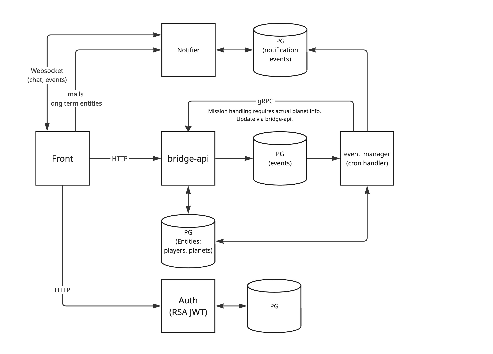

# Event-manager

- [Overview](#overview)
- [Events](#events)
- [Architecture](#architecture)
- [Development](#development)
- [Env](#env)

## Overview
EventManager processes user-generated events (missions, builds, researches, etc) using concurrent workers, each handling a specific event type.

### Events
The game is based on an event-based architecture. Different types of events are generated by a user using Bridge-API. Bridge-API constructs an event and posts it into a target table. Event-manager workers pull events from these tables and handle them transactionally. Transaction batch count and thread count are set using env variables.

Event types that are handled by the server are described below.

#### Mission events
Mission events (attack, spy, transport, recycle, and mission research) are posted by the Bridge-API to the **event_missions** table. Additionally, the Event Manager generates a return event to bring the fleet back after missions.

#### Build events
A user starts a build, and the Bridge-API generates and posts a corresponding event to the **event_buildings** table.

#### Research events
A user starts a research, and the Bridge-API generates and posts a corresponding event to the **event_researches** table.

#### Fleet construction events
A user starts a research, and the Bridge-API generates and posts a corresponding event to the **event_fleet_constructions** table.

## Architecture
Top level architecture is present on the diagram. 


## Development
To start working with the server, set up the Postgres database by applying migrations from [galaxy-empire-team/migrations](https://github.com/galaxy-empire-team/migrations). After installing the migrations, launch the project using the variables listed below. Workers will automatically start.

## Env
An example of environment variables required by an API:
```
// Optional variables
APP_LOG_LEVEL=info
APP_LOG_FORMAT=json

// Required variables
PG_HOST=localhost
PG_PORT=8090
PG_USERNAME=bormon
PG_PASSWORD=postgres_password
PG_DB_NAME=ge

WORKER_MISSION_EVENT_COUNT=10
WORKER_MISSION_THREAD_COUNT=1

WORKER_BUILD_EVENT_COUNT=10
WORKER_BUILD_THREAD_COUNT=1

WORKER_RESEARCH_EVENT_COUNT=10
WORKER_RESEARCH_THREAD_COUNT=1

WORKER_FLEET_CONSTRUCTION_EVENT_COUNT=10
WORKER_FLEET_CONSTRUCTION_THREAD_COUNT=1

BRIDGE_API_CLIENT_ENDPOINT=localhost:8001
```